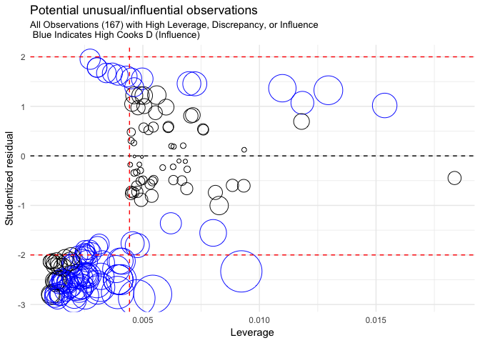
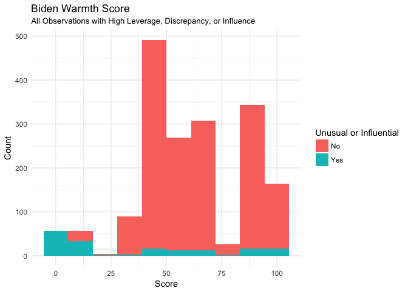
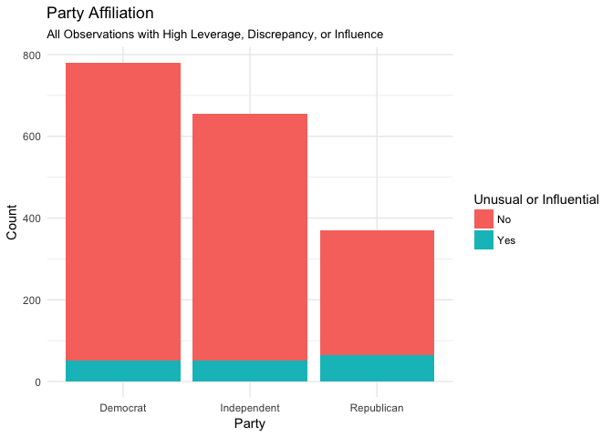
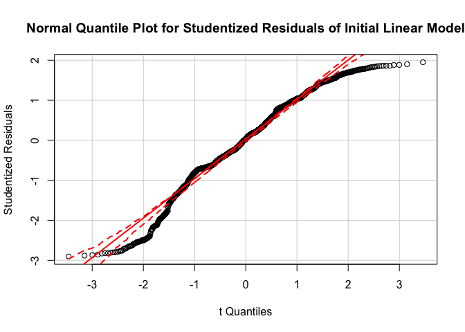
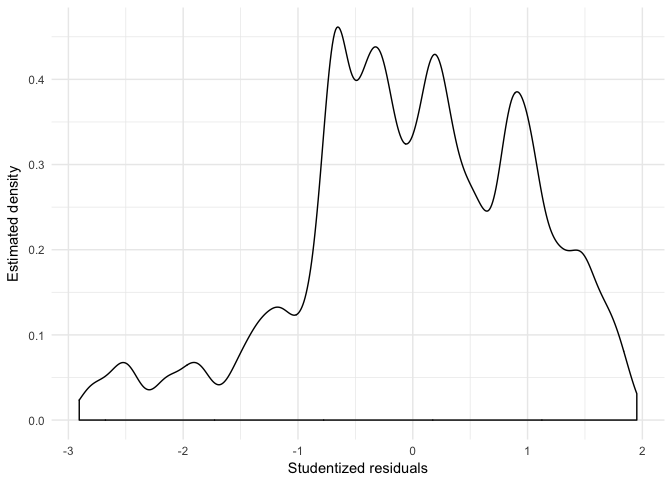
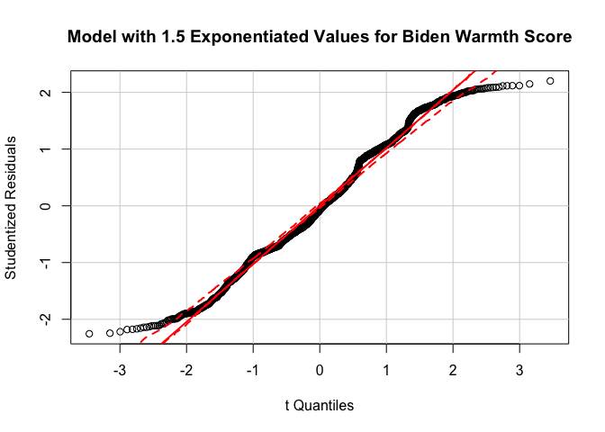
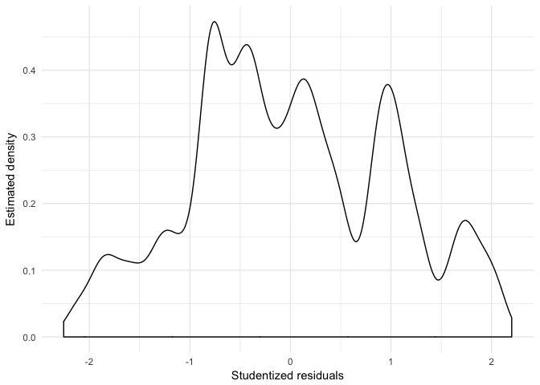
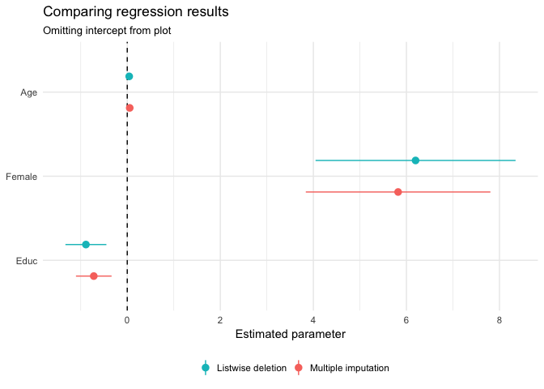

PS3 Perspectives for Computational Research
================
Rodrigo Valdes
May 14, 2017

-   [1. Regression diagnostics](#regression-diagnostics)
    -   [1.1 Identify any unusual and/or influential observations](#identify-any-unusual-andor-influential-observations)
    -   [1.2 Test for non-normality of errors](#test-for-non-normality-of-errors)
    -   [1.3 Test for non-normality of errors](#test-for-non-normality-of-errors-1)
    -   [1.4 Multicollinearity](#multicollinearity)
-   [2. Interaction Terms](#interaction-terms)
    -   [2.1 Evaluate the marginal effect of age on Joe Biden thermometer rating, conditional on education.](#evaluate-the-marginal-effect-of-age-on-joe-biden-thermometer-rating-conditional-on-education.)
    -   [2.2 Evaluate the marginal effect of education on Joe Biden thermometer rating, conditional on age.](#evaluate-the-marginal-effect-of-education-on-joe-biden-thermometer-rating-conditional-on-age.)
-   [3. Missing Data](#missing-data)

    ## 
    ## Call:
    ## lm(formula = biden ~ age + female + educ, data = .)
    ## 
    ## Coefficients:
    ## (Intercept)          age       female         educ  
    ##    68.62101      0.04188      6.19607     -0.88871

    ##          term    estimate  std.error statistic      p.value
    ## 1 (Intercept) 68.62101396 3.59600465 19.082571 4.337464e-74
    ## 2         age  0.04187919 0.03248579  1.289154 1.975099e-01
    ## 3      female  6.19606946 1.09669702  5.649755 1.863612e-08
    ## 4        educ -0.88871263 0.22469183 -3.955251 7.941295e-05

1. Regression diagnostics
=========================

1.1 Identify any unusual and/or influential observations
--------------------------------------------------------

According to the bubble plot, some observations can potentially affect the results. The most worrying ones are those in blue and with a high diameter, those with high Cook's D. From those, it is worthwhile to analyze closer how those are affecting the size of the coefficients of the model.

I will graph some of the characteristics of the complete dataset and those identifies as "weird."

As depicted by the graph of the Biden Warmth Score, some of the potential influential observations are in the extreme of the distribution. That is to say, with a score very close to zero or a hundred. Furthermore, the graph by party affiliation shows that Republican are overrepresented in the "weird" observations. Then, maybe those individuals look weird just because those are in a group of mainly Democrats. I will work cautiously before deleting those.

The model does not control by party affiliation, and that the graphs depict possible bias by party affiliation. The first step to deal with this unusual observations is to add party affiliation as a control. Afterwards, I will run a new analysis to look for unusual or influential observations. If those still exist, I will try with interactions between party affiliation and age, or party affiliation and gender.

1.2 Test for non-normality of errors
------------------------------------

 

The two graphs above show that the distribution of the residuals is not normal. The residuals are positively skewed. There are many possible ways to improve residual’s normality, like a monotonic transformation of the dependent and independent variables. However, in this case, given that there are dummy variables, I suggest transforming the warmth score.

I present an example of a transformation that can improve the distribution of the errors slightly below. I exponentiate Biden warmth by 1.5. Although this is better that the original one, it is possible to improve it further. The new density plot shows that the errors are closer to normal.

    ## 
    ## Call:
    ## lm(formula = biden_power ~ age + female + educ, data = .)
    ## 
    ## Coefficients:
    ## (Intercept)          age       female         educ  
    ##    573.3384       0.7513      66.9703      -9.5516

1.3 Test for non-normality of errors
------------------------------------

    ## 
    ##  studentized Breusch-Pagan test
    ## 
    ## data:  lm_init_biden
    ## BP = 22.559, df = 3, p-value = 4.989e-05

The small p-value of the Breusch-Pagan test indicates that heteroscedasticity can not be rejected. Then, the standard errors of the coefficients are not useful for inference. That is to say, variables that are significant maybe should not be; and insignificant variables might be significant.

1.4 Multicollinearity
---------------------

    ##      age   female     educ 
    ## 1.013369 1.001676 1.012275

The Variance Inflation Factors are below 10. As a result, we do not need to worry about multicollinearity.

2. Interaction Terms
====================

    ## 
    ## Call:
    ## lm(formula = biden ~ age + educ + age * educ, data = .)
    ## 
    ## Coefficients:
    ## (Intercept)          age         educ     age:educ  
    ##    38.37351      0.67187      1.65743     -0.04803

2.1 Evaluate the marginal effect of age on Joe Biden thermometer rating, conditional on education.
--------------------------------------------------------------------------------------------------

The marginal effect of age depends on the value of education. The equation for the marginal effect of age is the following:

$$\\frac{\\delta E(biden)}{\\delta age} = \\beta\_{1} + \\beta\_{3}educ$$

Now, considering the values of the regression,

$$\\frac{\\delta E(biden)}{\\delta age} = 0.67187 + -0.04803educ$$

This means that the relationship between the warmth value and age is not linear. In fact, for ages above 13.98855, the marginal effect is negative (all the individuals in the dataset are above 17). Meanwhile, the maximum conditional effect is when education is equal to zero, and it decreases as education increases.

Finally, the relationship is significant given the results of the hypothesis test depicted below.

    ## Linear hypothesis test
    ## 
    ## Hypothesis:
    ## age  + age:educ = 0
    ## 
    ## Model 1: restricted model
    ## Model 2: biden ~ age + educ + age * educ
    ## 
    ##   Res.Df    RSS Df Sum of Sq     F    Pr(>F)    
    ## 1   1804 985149                                 
    ## 2   1803 976688  1    8461.2 15.62 8.043e-05 ***
    ## ---
    ## Signif. codes:  0 '***' 0.001 '**' 0.01 '*' 0.05 '.' 0.1 ' ' 1

2.2 Evaluate the marginal effect of education on Joe Biden thermometer rating, conditional on age.
--------------------------------------------------------------------------------------------------

Similar to the former case, the marginal effect of education is:

$$\\frac{\\delta E(biden)}{\\delta educ} = \\beta\_{2} + \\beta\_{2}age$$

With the values of the regression,

$$\\frac{\\delta E(biden)}{\\delta educ} = 1.65743 + -0.04803age$$

The greatest marginal effect of eucation is when age is zero. Altought the minimum value for age in this dataset is eighteen. After that, the effect decreases while age increases. The relationship becomes negative above 34.53 years of education. However, it never happens in the dataset, where the maximum value for education is seventeen.

Finally, the relationship is significant as suggested by the significant test.

    ## Linear hypothesis test
    ## 
    ## Hypothesis:
    ## educ  + age:educ = 0
    ## 
    ## Model 1: restricted model
    ## Model 2: biden ~ age + educ + age * educ
    ## 
    ##   Res.Df    RSS Df Sum of Sq      F  Pr(>F)  
    ## 1   1804 979537                              
    ## 2   1803 976688  1    2849.1 5.2595 0.02194 *
    ## ---
    ## Signif. codes:  0 '***' 0.001 '**' 0.01 '*' 0.05 '.' 0.1 ' ' 1

3. Missing Data
===============

Before imputing values, I will try to analyze a way to transform the existing data to be closer to a multivariate normal.

According to the Henze-Zirkler's Normality test, the data is not distributed multivariate normal. Furthermore, the variables by themselves are not distributed normally, as showed in the Shapiro-Wilk's test.

    ##   Henze-Zirkler's Multivariate Normality Test 
    ## --------------------------------------------- 
    ##   data : preds %>% select(-c(biden, female, dem, rep)) 
    ## 
    ##   HZ      : 22.08529 
    ##   p-value : 0 
    ## 
    ##   Result  : Data are not multivariate normal. 
    ## ---------------------------------------------

    ## $`Descriptive Statistics`
    ## NULL
    ## 
    ## $`Shapiro-Wilk's Normality Test`
    ##    Variable Statistic   p-value Normality
    ## 1    age       0.9795         0    NO    
    ## 2   educ       0.9180         0    NO

One of the partial solutions is to convert age and education to its square root values. The new Henze-Zirkler's Normality test shows that the data with transformations (the square root values for age and education) decreases the statistic of the test from about 22 to about 15. However, the sample is still not distributed as a multivariate normal, but it is better that the original data.

    ## [1] "Sqrt age and educ"

    ##   Henze-Zirkler's Multivariate Normality Test 
    ## --------------------------------------------- 
    ##   data : biden_omit %>% select(sqrt_educ, sqrt_age) 
    ## 
    ##   HZ      : 15.33627 
    ##   p-value : 0 
    ## 
    ##   Result  : Data are not multivariate normal. 
    ## ---------------------------------------------

    ## $`Descriptive Statistics`
    ## NULL
    ## 
    ## $`Shapiro-Wilk's Normality Test`
    ##    Variable Statistic   p-value Normality
    ## 1 sqrt_educ    0.8639         0    NO    
    ## 2 sqrt_age     0.9841         0    NO

Finally, I run the regression with the transformations in the variables and imputing missing values.

The coefficients of the relevant variables are still in the same boundaries. That is to say, their confidence intervals are overlapped, and it is not possible to reject that those are statistically similar.
